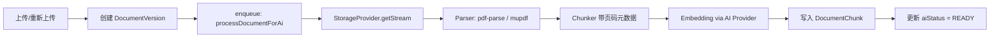
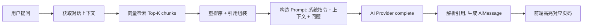

# ADR-001: v0.3 AI-Native Dataroom & Document Persistence

## 元数据

- **状态**: Proposed
- **作者**: Zed Agent
- **日期**: 2026-06-15
- **关联分支**: `feat/email-verification` → `dev` → `feat/ai-native-dataroom`
- **关联 PRD**: `tasks/prd-dochub.md`
- **关联战略**: `docs/adr/000-dochub-ai-strategic-positioning.md`
- **关联分析**: GitNexus 双库扫描（PaperTrail 1,448 symbols / papermark 18,761 symbols）

## 1. 背景与决策

DocHub v0.2 已完成核心 DocSend 链路：PDF 上传、分享链接、受控查看器、基础分析、团队/工作区、自定义域名，以及生产安全加固（邮箱验证、账户锁定、hCaptcha、GDPR 导出/删除、审计日志、请求上下文追踪、Prometheus 指标）。

v0.3 的核心命题是：**在自托管场景下形成对 Papermark 的结构性优势**。Papermark 功能全但依赖重（Vercel/Tinybird/Trigger.dev/外部 Vector Store/Stripe），且 AI 被当作企业版附加组件藏在 `ee/features/ai/` 中。DocHub 的机会是：

1. 把 AI 做成贯穿文档、数据室、链接治理的**原生智能层**；
2. 用 **PostgreSQL + pgvector + Redis** 替代 Papermark 的外部分析/向量依赖，保持自托管简单；
3. 补齐 DocSend 核心企业能力：Dataroom、文档版本、水印/NDA/名单等企业级链接控制。

**核心决策**：

| 决策项 | 选项 A（Papermark 式） | 选项 B（DocHub 式） | 选择 |
|---|---|---|---|
| AI 定位 | 企业版附加插件 | 原生核心能力 | B |
| 向量/分析 | Pinecone/Weaviate/Tinybird | PostgreSQL pgvector + Redis Streams | B |
| 文档版本 | 没有或后期补丁 | v0.3 即引入 `DocumentVersion` | B |
| 存储 | 绑定 UploadThing | 抽象 `IStorageProvider`，默认 UploadThing，预留 S3/Local | B |
| 隐私 | 默认走平台模型 | BYOK / Local / Cloud 三档 | B |

## 2. 设计目标

### 2.1 必须达成（P0）

- 文档持久化可版本化、可迁移、可支持多存储后端。
- AI 文档助手在 Viewer 内可用，答案带可点击页码引用。
- 数据室（Dataroom）支持文件夹、文档挂载、基础权限。
- 企业级链接控制：水印、允许/拒绝名单、NDA 门、截图保护、自定义 OG。

### 2.2 非目标

- v0.3 不实现 Papermark 的 Stripe 计费、Slack/Notion 集成、OIDC Provider。
- v0.3 不实现多团队（Multi-Team）；仍保持单 Workspace，但数据结构预留 `Dataroom` 级权限组。
- v0.3 不实现视频/Excel 解析；AI 解析以 PDF 为主，其他格式预留接口。

## 3. 文档持久化层重构（核心）

当前 `Document` 表同时承载「逻辑文档」和「物理文件」职责。v0.3 将其拆分为：

| 概念 | 当前 | v0.3 |
|---|---|---|
| 逻辑文档 | `Document` | `Document`（仅元数据 + latestVersion 查询） |
| 物理文件 | `Document.storageKey` | `DocumentVersion` |
| 文件内容索引 | 无 | `DocumentChunk`（pgvector） |
| 存储后端 | 写死 UploadThing | `IStorageProvider` 抽象 |

### 3.1 存储抽象接口

```typescript
// lib/storage/types.ts
export interface StorageMetadata {
  contentType: string;
  filename: string;
  workspaceId: string;
  uploaderId: string;
}

export interface PutResult {
  key: string;
  url?: string;        // 部分后端上传后可直接返回 URL
  size: number;
  contentType: string;
}

export interface IStorageProvider {
  put(
    buffer: Buffer,
    metadata: StorageMetadata,
  ): Promise<PutResult>;

  getSignedUrl(key: string, expiresInSeconds: number): Promise<string>;

  delete(key: string): Promise<void>;

  // 用于 AI 解析等场景直接读取流
  getStream(key: string): Promise<ReadableStream<Uint8Array> | Buffer>;
}
```

默认实现：

```typescript
// lib/storage/providers/uploadthing-provider.ts
export class UploadThingStorageProvider implements IStorageProvider {
  // 封装 @uploadthing/sdk，保留现有行为
}

// lib/storage/providers/s3-provider.ts（v0.4 实现）
// lib/storage/providers/local-provider.ts（v0.4 实现）
```

工厂根据环境选择：

```typescript
// lib/storage/factory.ts
export function getStorageProvider(): IStorageProvider {
  if (process.env.STORAGE_PROVIDER === "s3") return new S3StorageProvider();
  if (process.env.STORAGE_PROVIDER === "local") return new LocalStorageProvider();
  return new UploadThingStorageProvider();
}
```

### 3.2 文档版本模型

```prisma
model Document {
  id            String    @id @default(uuid())
  workspaceId   String    @map("workspace_id")
  uploadedBy    String    @map("uploaded_by")
  filename      String
  createdAt     DateTime  @default(now()) @map("created_at")
  updatedAt     DateTime  @updatedAt @map("updated_at")

  workspace     Workspace @relation(fields: [workspaceId], references: [id], onDelete: Cascade)
  uploader      User      @relation(fields: [uploadedBy], references: [id], onDelete: Cascade)
  links         ShareLink[]
  versions      DocumentVersion[]
  dataroomDocuments DataroomDocument[]

  @@map("documents")
}

model DocumentVersion {
  id            String      @id @default(uuid())
  documentId    String      @map("document_id")
  versionNumber Int         @map("version_number")
  storageKey    String      @map("storage_key")
  storageType   StorageType @default(UPLOADTHING) @map("storage_type")
  fileSize      Int         @map("file_size")
  pageCount     Int         @default(0) @map("page_count")
  contentType   String      @map("content_type")
  aiStatus      AiIndexStatus @default(PENDING) @map("ai_status")
  createdBy     String      @map("created_by")
  createdAt     DateTime    @default(now()) @map("created_at")

  document      Document    @relation(fields: [documentId], references: [id], onDelete: Cascade)
  creator       User        @relation(fields: [createdBy], references: [id], onDelete: Cascade)
  chunks        DocumentChunk[]

  @@unique([documentId, versionNumber])
  @@index([documentId, versionNumber])
  @@map("document_versions")
}

enum StorageType {
  UPLOADTHING
  S3
  LOCAL
}

enum AiIndexStatus {
  PENDING
  PROCESSING
  READY
  FAILED
}
```

**latest version 查询策略**：不引入循环外键，统一通过 `ORDER BY versionNumber DESC LIMIT 1` 获取。后续如性能需要，可添加物化字段或缓存。

### 3.3 向量索引与文档块

```prisma
model DocumentChunk {
  id              String   @id @default(uuid())
  documentVersionId String @map("document_version_id")
  content         String
  embedding       Unsupported("vector(1536)")
  pageNumber      Int      @map("page_number")
  paragraphIndex  Int?     @map("paragraph_index")
  metadata        Json?

  documentVersion DocumentVersion @relation(fields: [documentVersionId], references: [id], onDelete: Cascade)

  @@index([documentVersionId])
  @@map("document_chunks")
}
```

Migration SQL（手动）：

```sql
CREATE EXTENSION IF NOT EXISTS vector;

CREATE INDEX idx_document_chunks_embedding
ON document_chunks
USING hnsw (embedding vector_cosine_ops);
```

### 3.4 文档解析与索引流程



Chunking 策略（v0.3）：

- 默认按页切分，每页一个 chunk。
- 当单页文本 > 1500 tokens 时，按段落二次切分，保留 200 tokens overlap。
- 元数据强制保留：`pageNumber`、`paragraphIndex`，为引用高亮做准备。

## 4. 数据室（Dataroom）模型

```prisma
model Dataroom {
  id          String   @id @default(uuid())
  workspaceId String   @map("workspace_id")
  name        String
  description String?
  brand       Json?    // { logoUrl, primaryColor, faviconUrl }
  customDomain String? @unique @map("custom_domain")
  customDomainVerifiedAt DateTime? @map("custom_domain_verified_at")
  createdAt   DateTime @default(now()) @map("created_at")
  updatedAt   DateTime @updatedAt @map("updated_at")

  workspace   Workspace @relation(fields: [workspaceId], references: [id], onDelete: Cascade)
  folders     DataroomFolder[]
  documents   DataroomDocument[]
  permissions DataroomPermission[]
  links       ShareLink[]

  @@map("datarooms")
}

model DataroomFolder {
  id          String   @id @default(uuid())
  dataroomId  String   @map("dataroom_id")
  parentId    String?  @map("parent_id")
  name        String
  order       Int      @default(0)
  createdAt   DateTime @default(now()) @map("created_at")
  updatedAt   DateTime @updatedAt @map("updated_at")

  dataroom    Dataroom @relation(fields: [dataroomId], references: [id], onDelete: Cascade)
  parent      DataroomFolder? @relation(name: "FolderChildren", fields: [parentId], references: [id], onDelete: Cascade)
  children    DataroomFolder[] @relation(name: "FolderChildren")
  documents   DataroomDocument[]

  @@index([dataroomId])
  @@map("dataroom_folders")
}

model DataroomDocument {
  id          String   @id @default(uuid())
  dataroomId  String   @map("dataroom_id")
  folderId    String?  @map("folder_id")
  documentId  String   @map("document_id")
  order       Int      @default(0)
  addedBy     String   @map("added_by")
  addedAt     DateTime @default(now()) @map("added_at")

  dataroom    Dataroom @relation(fields: [dataroomId], references: [id], onDelete: Cascade)
  folder      DataroomFolder? @relation(fields: [folderId], references: [id], onDelete: Cascade)
  document    Document @relation(fields: [documentId], references: [id], onDelete: Cascade)

  @@unique([dataroomId, documentId])
  @@index([folderId])
  @@map("dataroom_documents")
}

model DataroomPermission {
  id          String   @id @default(uuid())
  dataroomId  String   @map("dataroom_id")
  userId      String?  @map("user_id")
  role        DataroomRole @default(VIEWER)
  createdAt   DateTime @default(now()) @map("created_at")

  dataroom    Dataroom @relation(fields: [dataroomId], references: [id], onDelete: Cascade)

  @@unique([dataroomId, userId])
  @@map("dataroom_permissions")
}

enum DataroomRole {
  ADMIN
  EDITOR
  VIEWER
}
```

**v0.3 简化**：数据室权限先做到用户级；`ViewerGroup` 和分组权限留到 v0.4。

## 5. 企业级链接治理扩展

`ShareLink` 从单文档链接升级为「文档或数据室」链接，并支持高级访问策略。

```prisma
model ShareLink {
  id              String    @id @default(uuid())
  documentId      String?   @map("document_id")
  dataroomId      String?   @map("dataroom_id")
  slug            String    @unique
  passwordHash    String?   @map("password_hash")
  expiresAt       DateTime? @map("expires_at")
  emailGate       Boolean   @default(false) @map("email_gate")
  allowDownload   Boolean   @default(false) @map("allow_download")

  // 企业级控制
  watermarkText   String?   @map("watermark_text")
  watermarkConfig Json?     @map("watermark_config")
  screenshotProtection Boolean @default(false) @map("screenshot_protection")
  confidentialView Boolean @default(false) @map("confidential_view")
  agreementId     String?   @map("agreement_id")
  allowList       String[]  @default([]) @map("allow_list")
  denyList        String[]  @default([]) @map("deny_list")
  customFields    Json?     @map("custom_fields")
  metaTags        Json?     @map("meta_tags") // { title, description, image, favicon }
  welcomeMessage  String?   @map("welcome_message")
  enableQuestion  Boolean   @default(false) @map("enable_question")
  questionText    String?   @map("question_text")
  tags            String[]  @default([])

  createdAt       DateTime  @default(now()) @map("created_at")
  updatedAt       DateTime  @updatedAt @map("updated_at")

  document        Document? @relation(fields: [documentId], references: [id], onDelete: Cascade)
  dataroom        Dataroom? @relation(fields: [dataroomId], references: [id], onDelete: Cascade)
  sessions        ViewSession[]
  viewerGrants    ViewerGrant[]

  @@index([documentId])
  @@index([dataroomId])
  @@map("share_links")
}
```

约束：每行必须满足 `documentId IS NOT NULL XOR dataroomId IS NOT NULL`，通过应用层 + 数据库 CHECK 约束保证。

```sql
ALTER TABLE share_links
ADD CONSTRAINT share_link_target_check
CHECK (
  (document_id IS NOT NULL AND dataroom_id IS NULL) OR
  (document_id IS NULL AND dataroom_id IS NOT NULL)
);
```

## 6. AI 架构

### 6.1 模型提供者抽象

```typescript
// lib/ai/providers/types.ts
export interface TokenUsage {
  promptTokens: number;
  completionTokens: number;
}

export interface CompletionOptions {
  messages: AiMessageInput[];
  temperature?: number;
  maxTokens?: number;
}

export interface EmbedOptions {
  text: string;
}

export interface IAiProvider {
  id: string;
  complete(options: CompletionOptions): Promise<{ content: string; usage: TokenUsage }>;
  embed(options: EmbedOptions): Promise<number[]>;
}
```

实现：

```typescript
// lib/ai/providers/openai-provider.ts
// lib/ai/providers/anthropic-provider.ts
// lib/ai/providers/ollama-provider.ts
```

### 6.2 Workspace AI 配置

```prisma
model AiProviderConfig {
  id          String   @id @default(uuid())
  workspaceId String   @unique @map("workspace_id")
  mode        AiProviderMode @default(CLOUD)
  provider    String   // openai | anthropic | ollama
  model       String
  apiKey      String?  @map("api_key") // AES-256-GCM 加密
  baseUrl     String?  @map("base_url")
  createdAt   DateTime @default(now()) @map("created_at")
  updatedAt   DateTime @updatedAt @map("updated_at")

  workspace   Workspace @relation(fields: [workspaceId], references: [id], onDelete: Cascade)

  @@map("ai_provider_configs")
}

enum AiProviderMode {
  CLOUD
  BYOK
  LOCAL
}
```

### 6.3 对话持久化

```prisma
model AiConversation {
  id          String   @id @default(uuid())
  scopeType   AiScopeType
  scopeId     String
  title       String?
  createdAt   DateTime @default(now()) @map("created_at")
  updatedAt   DateTime @updatedAt @map("updated_at")

  messages    AiMessage[]

  @@index([scopeType, scopeId])
  @@map("ai_conversations")
}

enum AiScopeType {
  DOCUMENT
  DATAROOM
  LINK
}

model AiMessage {
  id              String   @id @default(uuid())
  conversationId  String   @map("conversation_id")
  role            AiMessageRole
  content         String
  citations       Json?    // [{ pageNumber, chunkId, excerpt }]
  createdAt       DateTime @default(now()) @map("created_at")

  conversation    AiConversation @relation(fields: [conversationId], references: [id], onDelete: Cascade)

  @@index([conversationId])
  @@map("ai_messages")
}

enum AiMessageRole {
  USER
  ASSISTANT
  SYSTEM
}
```

### 6.4 RAG 查询流程



## 7. API 设计

| 端点 | 方法 | 说明 |
|---|---|---|
| `/api/datarooms` | GET / POST | 列表 / 创建数据室 |
| `/api/datarooms/[id]` | GET / PATCH / DELETE | 详情 / 更新 / 删除 |
| `/api/datarooms/[id]/folders` | GET / POST | 文件夹 CRUD |
| `/api/datarooms/[id]/documents` | GET / POST / DELETE | 挂载/移除文档 |
| `/api/datarooms/[id]/chat` | POST | 数据室级 AI 问答 |
| `/api/documents/[id]/versions` | GET / POST | 版本列表 / 上传新版本 |
| `/api/documents/[id]/versions/[versionId]/set-latest` | POST | 设为当前最新版 |
| `/api/documents/[id]/chat` | POST | 单文档 AI 问答 |
| `/api/workspaces/ai-config` | GET / PUT | AI 提供者配置 |
| `/api/share` | POST | 创建链接（扩展字段） |
| `/api/share/[id]` | GET / PATCH / DELETE | 链接详情 / 更新 / 删除 |
| `/api/ai/extract` | POST | 结构化提取（预留） |

所有 AI 端点强制：

- 限流（Redis-backed，按用户/按 workspace）
- `lib/audit.ts` 记录 `ai.query` 事件
- 权限校验（文档/数据室所有权）

## 8. 安全与隐私

### 8.1 BYOK 模式

- `apiKey` 使用 `NEXTAUTH_SECRET` 派生的密钥做 AES-256-GCM 加密。
- BYOK 模式下，平台不触碰模型流量计费，仅做代理。
- 应用层解密仅在需要调用模型时进行，不解密则不落盘日志。

### 8.2 Local 模式

- 通过 `baseUrl` 指向 Ollama / vLLM / 本地兼容 OpenAI 的端点。
- 所有 embedding + completion 不出服务器。

### 8.3 审计

所有 AI 调用、文档版本变更、数据室权限变更写入 `lib/audit.ts`：

```typescript
audit({
  action: "ai.query",
  actor: { userId, workspaceId },
  resource: { type: "document", id: documentId },
  metadata: { provider, model, conversationId, messageCount },
});
```

## 9. 迁移策略

### 9.1 数据迁移（零停机）

1. **创建新表**：`DocumentVersion`、`DocumentChunk`、`Dataroom*`、`Ai*`、`ShareLink` 扩展字段。
2. **Backfill DocumentVersion**：
   ```sql
   INSERT INTO document_versions (
     document_id, version_number, storage_key, storage_type,
     file_size, page_count, content_type, created_by, created_at
   )
   SELECT
     id, 1, storage_key, 'UPLOADTHING',
     file_size, page_count, 'application/pdf', uploaded_by, created_at
   FROM documents;
   ```
3. **标记旧字段 deprecated**：`Document.storageKey` / `fileSize` / `pageCount` 先保留 nullable，v0.4 后删除。
4. **创建 pgvector 索引**：raw SQL migration。
5. **异步索引已有文档**：对历史文档 enqueue `processDocumentForAi`，避免阻塞部署。

### 9.2 应用层兼容

- 所有读取 `Document.storageKey` 的代码迁移到 `DocumentVersion`。
- 提供 `getLatestVersion(documentId)` helper。
- `ShareLink.documentId` 改为 nullable；新增 `dataroomId`。

## 10. 实施阶段

### Phase 1：持久化与数据室骨架（2 周）

- T1: Storage abstraction + UploadThing provider
- T2: Prisma migration（DocumentVersion, Dataroom, pgvector）
- T3: 文档上传流程改造：创建 Document + DocumentVersion
- T4: Dataroom CRUD API + folder tree
- T5: Dataroom document mount/unmount

### Phase 2：企业级链接治理（2 周）

- T6: 扩展 ShareLink schema 与 API
- T7: 前端 Link Sheet（水印、名单、NDA、OG、标签）
- T8: Viewer 访问控制升级（验证名单、NDA、水印渲染）
- T9: 自定义 OG / 欢迎语 / 提问

### Phase 3：AI 基础设施（2 周）

- T10: pgvector setup + AI provider abstraction
- T11: 文档解析 pipeline + chunking + embedding job
- T12: `/api/documents/[id]/chat` + Viewer AI Panel
- T13: Workspace AI 设置页（BYOK/Local/Cloud）

### Phase 4：数据室智能与分析事件流（2 周）

- T14: `/api/datarooms/[id]/chat`
- T15: Redis Streams 替代 Tinybird 的事件采集（views, clicks, page_views）
- T16: 增强分析仪表盘（地理、设备、referrer）

## 11. 未解决问题

1. **Embedding 模型选择**：v0.3 默认 OpenAI `text-embedding-3-small`；Local 模式下是否要求用户自行提供 embedding 端点？
2. **PDF 解析库**：`pdf-parse` 轻量但维护停滞；`mupdf` 更强但依赖原生二进制。是否值得引入 `mupdf`？
3. **水印实现**：前端 Canvas 叠加 vs 后端 PDF 重绘。后端重绘更安全但计算重，v0.3 先用前端 overlay？
4. **数据室自定义域名**：是否与 Workspace 自定义域名合并？还是独立配置？

## 12. 下一步

本 ADR 进入 review。审阅通过后，可拆分为：

1. `tasks/issue-e0-document-persistence.md` — Phase 1 实施 issue
2. `tasks/issue-e1-dataroom.md`
3. `tasks/issue-e2-enterprise-links.md`
4. `tasks/issue-e3-ai-assistant.md`

要我继续把这份 ADR 拆成可抓取的 GitHub Issues，还是先根据你的反馈调整某几个决策（比如 Embedding 库、水印方案）？
