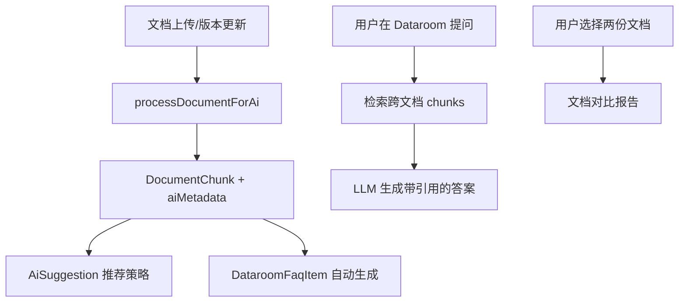

# ADR-002: v0.4 Dataroom Intelligence Layer & Growth Stack

## 元数据

- **状态**: Proposed
- **作者**: Zed Agent
- **日期**: 2026-06-15
- **前置 ADR**: `docs/adr/001-v0.3-ai-native-dataroom-and-document-persistence.md`
- **关联战略**: `docs/adr/000-dochub-ai-strategic-positioning.md`
- **主题**: 把 AI 从「单文档助手」升级为「数据室级智能体」，并叠加商业化增长栈。

## 1. 背景

v0.3 完成后，DocHub 将具备：

- Dataroom + 文件夹 + 基础权限
- 文档版本与多存储后端
- AI 文档助手（viewer 内 Q&A + 引用）
- 企业级链接治理（水印、NDA、名单、自定义 OG）

v0.4 的核心命题是：**让 AI 从「单文档」进化到「数据室级智能体」**。Papermark 的 AI 只能 chat with one document；DocHub 要在 v0.4 实现：

1. **跨文档问答**：在 Dataroom 内同时询问多份文件；
2. **文档对比**：自动对比两份 term sheet 或合同的条款差异；
3. **自动生成投资者 FAQ**：基于 Dataroom 内容生成可发布的 Q&A；
4. **AI 推荐链接策略**：根据文档内容推荐水印、NDA、viewer group。

同时，v0.4 必须完成商业化闭环：Stripe 计费、Viewer Groups、AI-Augmented Workflows、集成生态、高级分析。

## 2. 设计目标

### 2.1 P0

- **Dataroom 级智能体**：跨文档 Q&A、文档对比、Auto-FAQ、AI 策略推荐。
- Stripe 订阅计费 + 计划限制门控。
- AI-Augmented Workflows（触发器-动作引擎 + AI 建议）。
- 查看者分组（Viewer Groups）。
- 出站 Webhook + Slack/Notion 集成 + 公共 API。
- 高级分析：漏斗、留存、导出。

### 2.2 非目标

- 不实现完整 marketplace（v0.5）。
- 不实现实时协作/批注（v0.5）。
- 不实现 SAML/SSO（v0.5）。
- 不实现 E2EE（v0.5）。

## 3. E1: Dataroom Intelligence Layer（核心）

这是 v0.4 的**核心差异化能力**，全部建立在 v0.3 的 `IAiProvider` + `DocumentChunk` + pgvector 之上。

### 3.1 跨文档问答

- 用户在 Dataroom viewer 内提问时，检索范围扩展到该 Dataroom 下所有文档的最新版本 chunk。
- 答案引用来源文档与页码：「根据 `Term Sheet v2.pdf` 第 3 页……」。
- 支持过滤：「只在合同文件里找」。

实现：

```typescript
// lib/ai/dataroom-chat.ts
export async function askDataroom(
  dataroomId: string,
  question: string,
  options: { documentIds?: string[]; filters?: DataroomChatFilter },
): Promise<AiMessageWithCitations> {
  const chunks = await retrieveDataroomChunks(dataroomId, question, options);
  return completeWithCitations(chunks, question);
}
```

### 3.2 文档对比

- 选择两份 `DocumentVersion`，AI 生成差异报告：
  - 新增/删除/修改的条款
  - 关键数字变化（估值、股权比例、付款条件）
  - 风险标亮

API：

```
POST /api/documents/[id]/compare
{
  "baseVersionId": "...",
  "targetVersionId": "..."
}
```

### 3.3 自动生成投资者 FAQ

AI 扫描 Dataroom 内所有文档，生成常见问题与答案。运营人员可审核、编辑、隐藏。

```prisma
model DataroomFaqItem {
  id          String   @id @default(uuid())
  dataroomId  String   @map("dataroom_id")
  question    String
  answer      String
  sourceChunkIds String[] @map("source_chunk_ids")
  visibility  DataroomFaqVisibility @default(PUBLIC)
  status      DataroomFaqStatus @default(AUTO_GENERATED)
  createdAt   DateTime @default(now()) @map("created_at")
  updatedAt   DateTime @updatedAt @map("updated_at")
  
  dataroom    Dataroom @relation(fields: [dataroomId], references: [id], onDelete: Cascade)
  
  @@index([dataroomId])
  @@map("dataroom_faq_items")
}

enum DataroomFaqVisibility {
  PUBLIC    // 对外展示在 Dataroom 欢迎页
  PRIVATE   // 仅内部团队可见
}

enum DataroomFaqStatus {
  AUTO_GENERATED
  APPROVED
  HIDDEN
}
```

### 3.4 AI 推荐策略

文档解析完成后，AI 输出建议并写入 `AiSuggestion`，供用户一键采纳：

| 推荐类别 | 示例 |
|---|---|
| 水印 | 「检测到财务数据，建议开启动态水印」 |
| NDA | 「检测到未公开条款，建议启用 NDA 门」 |
| Viewer Group | 「建议仅允许 @investor.com 域名访问」 |
| 标签 | 「建议标签：Term Sheet, Series A」 |
| 权限 | 「建议将此文档放入保密文件夹」 |

```prisma
model AiSuggestion {
  id          String   @id @default(uuid())
  workspaceId String   @map("workspace_id")
  targetType  AiSuggestionTargetType // DOCUMENT | LINK | DATAROOM
  targetId    String   @map("target_id")
  category    AiSuggestionCategory // WATERMARK | NDA | VIEWER_GROUP | TAG | PERMISSION
  suggestion  Json     // { reason, payload }
  confidence  Float    // 0-1
  appliedAt   DateTime? @map("applied_at")
  dismissedAt DateTime? @map("dismissed_at")
  createdAt   DateTime @default(now()) @map("created_at")
  
  @@index([workspaceId, targetType, targetId])
  @@map("ai_suggestions")
}

enum AiSuggestionTargetType {
  DOCUMENT
  LINK
  DATAROOM
}

enum AiSuggestionCategory {
  WATERMARK
  NDA
  VIEWER_GROUP
  TAG
  PERMISSION
}
```

### 3.5 数据室智能体的数据流



## 4. E2: Billing & Plans (Stripe)

### 4.1 计费模型

AI 能力是计费的核心差异化卖点：

| 计划 | 文档数 | Dataroom | AI 查询/月 | 版本数 | 自定义域名 | Dataroom 级智能 |
|---|---|---|---|---|---|---|
| Free | 5 | 0 | 50 | 3 | 否 | 否 |
| Starter | 50 | 1 | 500 | 10 | 是 | 基础跨文档问答 |
| Pro | 500 | 10 | 5000 | 无限 | 是 | 完整智能体 |
| Enterprise | 无限 | 无限 | 定制 | 无限 | 是 | 完整 + BYOK/Local |

### 4.2 数据模型

```prisma
model BillingCustomer {
  id          String   @id @default(uuid())
  workspaceId String   @unique @map("workspace_id")
  stripeCustomerId String @map("stripe_customer_id") @unique
  createdAt   DateTime @default(now()) @map("created_at")
  
  workspace   Workspace @relation(fields: [workspaceId], references: [id], onDelete: Cascade)
  subscriptions Subscription[]
  invoices    Invoice[]
  
  @@map("billing_customers")
}

model Subscription {
  id          String   @id @default(uuid())
  billingCustomerId String @map("billing_customer_id")
  stripeSubscriptionId String @map("stripe_subscription_id") @unique
  status      SubscriptionStatus
  plan        PlanEnum
  currentPeriodStart DateTime @map("current_period_start")
  currentPeriodEnd DateTime @map("current_period_end")
  cancelAtPeriodEnd Boolean @default(false) @map("cancel_at_period_end")
  
  billingCustomer BillingCustomer @relation(fields: [billingCustomerId], references: [id], onDelete: Cascade)
  
  @@map("subscriptions")
}

model Invoice {
  id          String   @id @default(uuid())
  billingCustomerId String @map("billing_customer_id")
  stripeInvoiceId String @map("stripe_invoice_id") @unique
  amount      Int
  currency    String   @default("usd")
  status      InvoiceStatus
  createdAt   DateTime @default(now()) @map("created_at")
  
  billingCustomer BillingCustomer @relation(fields: [billingCustomerId], references: [id], onDelete: Cascade)
  
  @@map("invoices")
}

model WorkspaceLimit {
  id          String   @id @default(uuid())
  workspaceId String   @unique @map("workspace_id")
  plan        PlanEnum
  limits      Json     // { documents: 100, datarooms: 3, aiQueries: 1000, dataroomIntelligence: true }
  
  workspace   Workspace @relation(fields: [workspaceId], references: [id], onDelete: Cascade)
  
  @@map("workspace_limits")
}

enum SubscriptionStatus {
  INCOMPLETE
  ACTIVE
  PAST_DUE
  CANCELED
  UNPAID
}

enum InvoiceStatus {
  DRAFT
  OPEN
  PAID
  UNCOLLECTIBLE
  VOID
}

enum PlanEnum {
  FREE
  STARTER
  PRO
  ENTERPRISE
}
```

### 4.3 Feature Gates

```typescript
// lib/billing/guards.ts
export enum Feature {
  DATAROOM = "dataroom",
  DATAROOM_INTELLIGENCE = "dataroom_intelligence",
  DOCUMENT_COMPARE = "document_compare",
  AUTO_FAQ = "auto_faq",
  AI_SUGGESTIONS = "ai_suggestions",
  CUSTOM_DOMAIN = "custom_domain",
  AI_QUERIES = "ai_queries",
  WATERMARK = "watermark",
  WORKFLOW = "workflow",
  API_KEY = "api_key",
}

export function requirePlan(feature: Feature, workspace: WorkspaceWithLimit) {
  if (!hasFeatureAccess(feature, workspace.plan)) {
    throw new PlanRequiredError(feature);
  }
}
```

## 5. E3: AI-Augmented Workflows

### 5.1 确定性工作流引擎（基础）

保留 v0.4 原计划的触发器-动作引擎：

- 触发器：`DOCUMENT_VIEWED`、`DOCUMENT_DOWNLOADED`、`LINK_CREATED`、`DATAROOM_ACCESSED`、`AGREEMENT_SIGNED`、`AI_QUESTION_ASKED`
- 动作：`SEND_EMAIL`、`SEND_SLACK_MESSAGE`、`CALL_WEBHOOK`、`CREATE_TASK`、`MOVE_TO_FOLDER`、`UPDATE_TAG`、`NOTIFY_OWNER`

### 5.2 AI 增强

1. **AI 建议工作流模板**：
   - 上传 term sheet 后，AI 建议「当投资者查看超过 3 次时通知创始人」。
2. **自然语言创建工作流**：
   - 用户输入：「有人下载保密文件时发邮件给我」→ AI 生成对应 Workflow + Steps。
3. **智能条件判断**：
   - Workflow 条件步骤可由 LLM 根据事件语义判断，例如「如果用户提问涉及价格条款，则升级通知」。

### 5.3 数据模型

```prisma
model Workflow {
  id          String   @id @default(uuid())
  workspaceId String   @map("workspace_id")
  name        String
  triggerType WorkflowTriggerType
  config      Json     // trigger-specific filter
  isActive    Boolean @default(true) @map("is_active")
  isAiGenerated Boolean @default(false) @map("is_ai_generated")
  createdAt   DateTime @default(now()) @map("created_at")
  
  workspace   Workspace @relation(fields: [workspaceId], references: [id], onDelete: Cascade)
  steps       WorkflowStep[]
  executions  WorkflowExecution[]
  
  @@index([workspaceId])
  @@map("workflows")
}

model WorkflowStep {
  id          String   @id @default(uuid())
  workflowId  String   @map("workflow_id")
  type        WorkflowStepType
  config      Json
  order       Int
  createdAt   DateTime @default(now()) @map("created_at")
  
  workflow    Workflow @relation(fields: [workflowId], references: [id], onDelete: Cascade)
  
  @@map("workflow_steps")
}

model WorkflowExecution {
  id          String   @id @default(uuid())
  workflowId  String   @map("workflow_id")
  status      ExecutionStatus
  payload     Json
  result      Json?
  error       String?
  startedAt   DateTime @default(now()) @map("started_at")
  completedAt DateTime? @map("completed_at")
  
  workflow    Workflow @relation(fields: [workflowId], references: [id], onDelete: Cascade)
  
  @@index([workflowId])
  @@map("workflow_executions")
}

enum WorkflowTriggerType {
  DOCUMENT_VIEWED
  DOCUMENT_DOWNLOADED
  LINK_CREATED
  DATAROOM_ACCESSED
  AGREEMENT_SIGNED
  AI_QUESTION_ASKED
}

enum WorkflowStepType {
  SEND_EMAIL
  SEND_SLACK_MESSAGE
  CALL_WEBHOOK
  CREATE_TASK
  MOVE_TO_FOLDER
  UPDATE_TAG
  NOTIFY_OWNER
  AI_CONDITION    // LLM 判断条件分支
}

enum ExecutionStatus {
  PENDING
  RUNNING
  COMPLETED
  FAILED
}
```

## 6. E4: Viewer Groups & Advanced Permissions

### 6.1 数据模型

```prisma
model ViewerGroup {
  id          String   @id @default(uuid())
  workspaceId String   @map("workspace_id")
  name        String
  description String?
  createdAt   DateTime @default(now()) @map("created_at")
  
  workspace   Workspace @relation(fields: [workspaceId], references: [id], onDelete: Cascade)
  members     ViewerGroupMember[]
  linkGroups  LinkViewerGroup[]
  dataroomPermissions DataroomPermission[]
  
  @@index([workspaceId])
  @@map("viewer_groups")
}

model ViewerGroupMember {
  id          String   @id @default(uuid())
  viewerGroupId String @map("viewer_group_id")
  email       String
  name        String?
  createdAt   DateTime @default(now()) @map("created_at")
  
  viewerGroup ViewerGroup @relation(fields: [viewerGroupId], references: [id], onDelete: Cascade)
  
  @@unique([viewerGroupId, email])
  @@map("viewer_group_members")
}

model LinkViewerGroup {
  id          String   @id @default(uuid())
  linkId      String   @map("link_id")
  viewerGroupId String @map("viewer_group_id")
  createdAt   DateTime @default(now()) @map("created_at")
  
  link        ShareLink @relation(fields: [linkId], references: [id], onDelete: Cascade)
  viewerGroup ViewerGroup @relation(fields: [viewerGroupId], references: [id], onDelete: Cascade)
  
  @@unique([linkId, viewerGroupId])
  @@map("link_viewer_groups")
}
```

### 6.2 AI 推荐 Viewer Group

AI 根据文档内容建议应授予哪些域名/组织的访问权限，并生成对应的 Viewer Group 草稿。

## 7. E5: Integrations Ecosystem

### 7.1 集成抽象

```typescript
// lib/integrations/types.ts
export type IntegrationType = "SLACK" | "NOTION" | "WEBHOOK";

export interface IIntegrationHandler {
  type: IntegrationType;
  validateConfig(config: unknown): { valid: boolean; errors?: string[] };
  execute(action: string, payload: unknown, config: unknown): Promise<void>;
}
```

### 7.2 集成类型

| 类型 | 能力 |
|---|---|
| Slack | 文档被查看/下载时通知频道；Dataroom 高意向访问提醒 |
| Notion | 导入 Notion 页面为 PDF；导出 Dataroom 目录/FAQ 为 Notion 数据库 |
| Webhook | 出站 HTTP POST，支持 HMAC 签名与重试 |
| Zapier/Make | 通过 webhook 触发外部流程 |

### 7.3 数据模型

```prisma
model Integration {
  id          String   @id @default(uuid())
  workspaceId String   @map("workspace_id")
  type        IntegrationType
  name        String
  config      Json     // encrypted tokens/settings
  isActive    Boolean @default(true) @map("is_active")
  createdAt   DateTime @default(now()) @map("created_at")
  
  workspace   Workspace @relation(fields: [workspaceId], references: [id], onDelete: Cascade)
  
  @@index([workspaceId])
  @@map("integrations")
}

enum IntegrationType {
  SLACK
  NOTION
  WEBHOOK
}

model ApiKey {
  id          String   @id @default(uuid())
  workspaceId String   @map("workspace_id")
  name        String
  hashedKey   String   @map("hashed_key")
  scopes      String[] // documents:read, links:write, etc.
  lastUsedAt  DateTime? @map("last_used_at")
  expiresAt   DateTime? @map("expires_at")
  createdAt   DateTime @default(now()) @map("created_at")
  
  workspace   Workspace @relation(fields: [workspaceId], references: [id], onDelete: Cascade)
  
  @@index([workspaceId])
  @@map("api_keys")
}
```

## 8. E6: Advanced Analytics

在 v0.3 Redis Streams 事件流基础上，构建：

- **漏斗分析**：Link Created → Viewed → Downloaded → Agreement Signed
- **AI 交互分析**：哪些问题被问得最多？AI 答案采纳率如何？
- **留存分析**：7/30 天回访率
- **地理/设备/浏览器分布**
- **CSV/Excel 导出**
- **实时活动 feed**

### 8.1 数据保留策略

| 热度 | 存储 | 保留期 |
|---|---|---|
| 热数据 | Redis Streams | 7 天 |
| 温数据 | PostgreSQL 聚合表 | 90 天 |
| 冷数据 | S3 / Local 归档 | 可配置 |

### 8.2 聚合表

```prisma
model AnalyticsDaily {
  id          String   @id @default(uuid())
  workspaceId String   @map("workspace_id")
  documentId  String?  @map("document_id")
  dataroomId  String?  @map("dataroom_id")
  date        DateTime
  views       Int      @default(0)
  uniqueViewers Int    @default(0) @map("unique_viewers")
  downloads   Int      @default(0)
  avgDuration Int      @default(0) @map("avg_duration")
  aiQueries   Int      @default(0) @map("ai_queries")
  
  @@unique([workspaceId, documentId, dataroomId, date])
  @@map("analytics_daily")
}
```

## 9. API 设计

| 端点 | 方法 | 说明 |
|---|---|---|
| `/api/datarooms/[id]/chat` | POST | 数据室跨文档问答 |
| `/api/datarooms/[id]/faq` | GET / POST | Auto-FAQ 列表/生成 |
| `/api/datarooms/[id]/faq/[faqId]` | PATCH / DELETE | FAQ 审核/隐藏 |
| `/api/documents/[id]/compare` | POST | 文档对比 |
| `/api/ai/suggestions` | GET | AI 推荐策略列表 |
| `/api/ai/suggestions/[id]/apply` | POST | 采纳推荐 |
| `/api/billing/checkout` | POST | 创建 Stripe Checkout Session |
| `/api/billing/portal` | POST | Stripe 客户门户 |
| `/api/billing/subscription` | GET | 当前订阅 |
| `/api/workspaces/limits` | GET | 计划限制 |
| `/api/viewer-groups` | GET / POST | 查看者分组 |
| `/api/viewer-groups/[id]` | PATCH / DELETE | 分组更新/删除 |
| `/api/workflows` | GET / POST | 工作流 |
| `/api/workflows/[id]` | GET / PATCH / DELETE | 工作流详情/更新/删除 |
| `/api/workflows/[id]/executions` | GET | 执行历史 |
| `/api/integrations` | GET / POST | 集成配置 |
| `/api/webhooks/outgoing` | GET / POST | 出站 webhook |
| `/api/api-keys` | GET / POST | API Key 管理 |
| `/api/analytics/funnel` | GET | 漏斗分析 |
| `/api/analytics/export` | POST | 导出分析数据 |

## 10. 安全与隐私

- Stripe webhook 签名验证（`stripe-signature`）
- API Key 使用 SHA-256 hash + prefix 显示，完整 secret 仅创建时可见
- 集成 token（Slack/Notion）AES-256-GCM 加密
- AI 查询与 Dataroom 内容严格按 workspace 隔离
- 工作流执行沙箱：限制网络请求超时（10s）、重试 3 次、禁止访问内网
- 所有计费/工作流/集成/AI 操作写入 `lib/audit.ts`

## 11. 迁移策略

1. **新增计费表**：`BillingCustomer`、`Subscription`、`Invoice`、`WorkspaceLimit`
2. **现有 workspace 默认 plan = FREE**，limits 按 Free 计划填充
3. **新增分组表**：`ViewerGroup`、`ViewerGroupMember`、`LinkViewerGroup`
4. **扩展 DataroomPermission**：新增 `viewerGroupId`
5. **新增 AI 智能体表**：`DataroomFaqItem`、`AiSuggestion`
6. **扩展 Workflow**：新增 `AI_CONDITION` step type、`isAiGenerated`
7. **扩展 AnalyticsDaily**：新增 `aiQueries`
8. **注册 Stripe webhook endpoint**：`/api/webhooks/stripe`

## 12. 实施阶段

### Phase 1：Dataroom Intelligence Layer（3 周）

- 跨文档 Q&A 检索实现
- 文档对比 API
- Auto-FAQ 生成与审核
- AI Suggestion 推荐策略

### Phase 2：计费与门控（2 周）

- Stripe 接入
- Plan & WorkspaceLimit
- Feature gates
- 订阅管理 UI

### Phase 3：AI-Augmented Workflows（2 周）

- Workflow engine
- AI 建议模板
- 自然语言创建工作流

### Phase 4：Viewer Groups + Integrations（2 周）

- ViewerGroup CRUD
- Link/Dataroom group binding
- Slack/Notion/Webhook handlers
- API Key + 公共 API `/api/v1`

### Phase 5：高级分析（1 周）

- Funnel/retention queries
- AI 交互分析
- CSV/Excel 导出

**总计：~10 周**

## 13. 未解决问题

1. **计费货币**：仅 USD 还是多币种？
2. **Dataroom FAQ 生成频率**：每次文档更新都重新生成，还是手动触发？
3. **AI Suggestion 保留期**：未采纳的推荐是否自动过期？
4. **工作流限制**：Free 计划是否允许工作流？如果允许，限制条数/月？
5. **文档对比的 token 成本**：长合同对比可能消耗大量 token，是否限制页数？

## 14. 下一步

审阅本 ADR 后，可拆分为：

1. `tasks/issue-v0.4-dataroom-intelligence.md`
2. `tasks/issue-v0.4-billing.md`
3. `tasks/issue-v0.4-ai-workflows.md`
4. `tasks/issue-v0.4-integrations.md`
5. `tasks/issue-v0.4-analytics.md`
