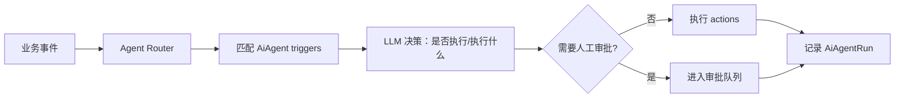

# ADR-003: v0.5 Autonomous Document Intelligence Platform

## 元数据

- **状态**: Proposed
- **作者**: Zed Agent
- **日期**: 2026-06-15
- **前置 ADR**: `docs/adr/002-v0.4-dataroom-intelligence-layer-and-growth-stack.md`
- **关联战略**: `docs/adr/000-dochub-ai-strategic-positioning.md`
- **主题**: 让 AI Agent 自主运行文档室，形成企业级平台护城河。

## 1. 背景

v0.4 完成后，DocHub 将具备「数据室级智能体」：

- 跨文档问答与文档对比
- AI 推荐链接策略与 Viewer Group
- AI-Augmented Workflows
- Stripe 计费、Viewer Groups、集成生态、公共 API

v0.5 的目标是让这些智能体**从被动响应进化为主动执行**，并形成企业级平台护城河：

1. **AI Agent 自主运行**：基于 v0.4 的 Dataroom Intelligence，DealRoom/Compliance/Sales/DocOps Agent 能主动决策、执行动作、请求审批。
2. **企业级组织与合规**：Organization、SAML/SSO、数据驻留、审计保留策略。
3. **知识网络与扩展**：跨数据室联邦搜索、知识图谱、插件系统。

## 2. 设计目标

### 2.1 P0

- 多工作区组织（Organization）
- SAML / OIDC SSO
- AI Agents（自主执行）
- PDF 批注与实时协作
- 跨数据室联邦搜索
- 插件系统

### 2.2 非目标

- 不替代 CRM/ERP（保持文档室专注）
- 不实现通用低代码平台（工作流已在 v0.4）
- 不实现通用即时通讯（批注评论仅围绕文档）

## 3. E1: Multi-Workspace Organizations

### 3.1 数据模型

```prisma
model Organization {
  id          String   @id @default(uuid())
  name        String
  slug        String   @unique
  settings    Json?    // branding, security policies, dataRegion
  createdAt   DateTime @default(now()) @map("created_at")
  updatedAt   DateTime @updatedAt @map("updated_at")
  
  workspaces  Workspace[]
  members     OrganizationMembership[]
  samlConnections SamlConnection[]
  securitySettings SecuritySettings?
  
  @@map("organizations")
}

model OrganizationMembership {
  id          String   @id @default(uuid())
  organizationId String @map("organization_id")
  userId      String   @map("user_id")
  role        OrganizationRole @default(MEMBER)
  createdAt   DateTime @default(now()) @map("created_at")
  updatedAt   DateTime @updatedAt @map("updated_at")
  
  organization Organization @relation(fields: [organizationId], references: [id], onDelete: Cascade)
  
  @@unique([organizationId, userId])
  @@map("organization_memberships")
}

enum OrganizationRole {
  OWNER
  ADMIN
  MEMBER
}

model Workspace {
  // 保留 v0.3/v0.4 现有字段...
  organizationId String? @map("organization_id")
  organization   Organization? @relation(fields: [organizationId], references: [id], onDelete: SetNull)
}
```

### 3.2 影响

- 一个 Organization 可包含多个 Workspace（按项目/品牌/部门）。
- 现有单 Workspace 用户 `organizationId` 为 null，向后兼容。
- Organization owner 可管理所有下属 Workspace 的计费与安全策略。

### 3.3 SCIM（可选）

v0.5 先预留 SCIM 接口结构，不强制实现：

```
GET    /scim/v2/Users
POST   /scim/v2/Users
PUT    /scim/v2/Users/:id
DELETE /scim/v2/Users/:id
GET    /scim/v2/Groups
```

## 4. E2: Enterprise Identity & Security

### 4.1 SAML / OIDC SSO

采用 `@boxyhq/saml-jackson`（与 Papermark 相同选择，成熟可靠，自托管友好）。

```prisma
model SamlConnection {
  id          String   @id @default(uuid())
  organizationId String @map("organization_id")
  provider    String   // okta | azuread | google_workspace | generic
  metadataUrl String?  @map("metadata_url")
  metadataXml String?  @map("metadata_xml")
  isActive    Boolean @default(true) @map("is_active")
  createdAt   DateTime @default(now()) @map("created_at")
  updatedAt   DateTime @updatedAt @map("updated_at")
  
  organization Organization @relation(fields: [organizationId], references: [id], onDelete: Cascade)
  
  @@index([organizationId])
  @@map("saml_connections")
}
```

登录流程：

```
用户输入邮箱 → 匹配 Organization → 发现 SAML → 重定向到 IdP →
SAML 断言验证 → 创建/更新 User → 登录成功
```

### 4.2 数据驻留与合规

```prisma
model SecuritySettings {
  id          String   @id @default(uuid())
  organizationId String @unique @map("organization_id")
  dataRegion  String?  @map("data_region") // eu | us | apac
  requireSso  Boolean @default(false) @map("require_sso")
  retentionDays Int?   @map("retention_days")
  auditLogRetentionDays Int @default(365) @map("audit_log_retention_days")
  allowedEmailDomains String[] @default([]) @map("allowed_email_domains")
  requireMfa  Boolean @default(false) @map("require_mfa")
  
  organization Organization @relation(fields: [organizationId], references: [id], onDelete: Cascade)
  
  @@map("security_settings")
}
```

### 4.3 E2EE（可选高级功能）

高合规场景提供端到端加密：

- 文档在上传前由客户端加密（AES-256-GCM）
- 服务端存储密文
- 只有持密钥的查看者能解密
- 代价：AI 无法解析加密文档，需用户手动选择「可 AI 索引」或「端到端加密」

## 5. E3: AI Agents

v0.4 的 Dataroom Intelligence Layer 已经能回答跨文档问题、对比文件、推荐策略；v0.5 的 AI Agent 在此基础上增加**自主决策与执行能力**——它不仅能告诉用户该做什么，还能在授权范围内直接去做。

### 5.1 Agent 类型

| Agent | 职责 | 触发示例 |
|---|---|---|
| DealRoomAgent | 回答投资者问题、推送高意向提醒、生成访问摘要 | 数据室被访问时 |
| ComplianceAgent | 检查 NDA 签署、标记敏感条款、审计异常访问 | 文档上传/链接创建时 |
| SalesAgent | 追踪买家参与度、推荐下一步行动、同步 CRM | 文档被多次查看时 |
| DocOpsAgent | 自动归档过期文档、整理文件夹、清理重复版本 | 定时触发 |

### 5.2 数据模型

```prisma
model AiAgent {
  id          String   @id @default(uuid())
  workspaceId String   @map("workspace_id")
  type        AiAgentType
  name        String
  instructions String  // 系统提示词
  triggers    Json     // [{ event, filter }]
  actions     Json     // [{ type, config }]
  isActive    Boolean @default(true) @map("is_active")
  createdAt   DateTime @default(now()) @map("created_at")
  updatedAt   DateTime @updatedAt @map("updated_at")
  
  workspace   Workspace @relation(fields: [workspaceId], references: [id], onDelete: Cascade)
  runs        AiAgentRun[]
  
  @@index([workspaceId])
  @@map("ai_agents")
}

model AiAgentRun {
  id          String   @id @default(uuid())
  agentId     String   @map("agent_id")
  status      AgentRunStatus
  triggerEvent Json    @map("trigger_event")
  llmDecision Json?    @map("llm_decision") // 模型推理过程
  result      Json?
  error       String?
  startedAt   DateTime @default(now()) @map("started_at")
  completedAt DateTime? @map("completed_at")
  
  agent       AiAgent @relation(fields: [agentId], references: [id], onDelete: Cascade)
  
  @@index([agentId])
  @@map("ai_agent_runs")
}

enum AiAgentType {
  DEAL_ROOM
  COMPLIANCE
  SALES
  DOC_OPS
  CUSTOM
}

enum AgentRunStatus {
  PENDING
  RUNNING
  COMPLETED
  FAILED
  NEEDS_APPROVAL
}
```

### 5.3 执行架构



### 5.4 Agent 与 Workflow 的区别

| 维度 | Workflow | AI Agent |
|---|---|---|
| 决策 | 确定性规则 | LLM 自主决策 |
| 触发 | 精确匹配事件 | 语义理解事件上下文 |
| 动作 | 预定义步骤 | 可动态选择动作组合 |
| 审批 | 无 | 可配置「需要审批」阈值 |

## 6. E4: Real-Time Collaboration

### 6.1 数据模型

```prisma
model DocumentAnnotation {
  id          String   @id @default(uuid())
  documentVersionId String @map("document_version_id")
  pageNumber  Int      @map("page_number")
  type        AnnotationType // HIGHLIGHT | NOTE | SIGNATURE | DRAWING
  position    Json     // { x, y, width, height } or { points: [] }
  content     String?
  color       String?
  createdBy   String   @map("created_by")
  createdAt   DateTime @default(now()) @map("created_at")
  updatedAt   DateTime @updatedAt @map("updated_at")
  
  documentVersion DocumentVersion @relation(fields: [documentVersionId], references: [id], onDelete: Cascade)
  comments    AnnotationComment[]
  
  @@index([documentVersionId, pageNumber])
  @@map("document_annotations")
}

model AnnotationComment {
  id          String   @id @default(uuid())
  annotationId String @map("annotation_id")
  content     String
  createdBy   String   @map("created_by")
  createdAt   DateTime @default(now()) @map("created_at")
  
  annotation  DocumentAnnotation @relation(fields: [annotationId], references: [id], onDelete: Cascade)
  
  @@index([annotationId])
  @@map("annotation_comments")
}

enum AnnotationType {
  HIGHLIGHT
  NOTE
  SIGNATURE
  DRAWING
}
```

### 6.2 版本对比

提供 side-by-side 版本差异视图：

- 文本差异高亮
- 页面增删标识
- 批注跨版本保留策略

### 6.3 实时性

v0.5 采用轻量轮询 + 乐观更新，不引入 WebSocket：

- 批注创建后立即本地 optimistic render
- 每 5 秒轮询同步他人批注
- 冲突时以 server timestamp 为准

## 7. E5: Federated Search & Knowledge Graph

### 7.1 跨数据室搜索

基于 v0.3 pgvector，支持：

- 跨 Dataroom 语义搜索
- 按实体过滤（公司、人、日期）
- 搜索结果带来源文档和页码
- 自然语言问句直接转为 RAG 查询

### 7.2 实体与关系

```prisma
model KnowledgeEntity {
  id          String   @id @default(uuid())
  workspaceId String   @map("workspace_id")
  type        EntityType // PERSON | COMPANY | DATE | TERM | PRODUCT
  name        String
  normalizedName String @map("normalized_name")
  metadata    Json?
  createdAt   DateTime @default(now()) @map("created_at")
  
  workspace   Workspace @relation(fields: [workspaceId], references: [id], onDelete: Cascade)
  relationsAsSource KnowledgeRelation[] @relation("SourceEntity")
  relationsAsTarget KnowledgeRelation[] @relation("TargetEntity")
  
  @@unique([workspaceId, normalizedName, type])
  @@map("knowledge_entities")
}

model KnowledgeRelation {
  id          String   @id @default(uuid())
  sourceId    String   @map("source_id")
  targetId    String   @map("target_id")
  type        RelationType // MENTIONS | COMPETES_WITH | ACQUIRED | EMPLOYS
  documentVersionId String @map("document_version_id")
  evidenceText String? @map("evidence_text")
  createdAt   DateTime @default(now()) @map("created_at")
  
  source      KnowledgeEntity @relation("SourceEntity", fields: [sourceId], references: [id], onDelete: Cascade)
  target      KnowledgeEntity @relation("TargetEntity", fields: [targetId], references: [id], onDelete: Cascade)
  
  @@map("knowledge_relations")
}

enum EntityType {
  PERSON
  COMPANY
  DATE
  TERM
  PRODUCT
}

enum RelationType {
  MENTIONS
  COMPETES_WITH
  ACQUIRED
  EMPLOYS
  PARTNERS_WITH
}
```

### 7.3 实体提取流程

文档 chunk → LLM NER → 归一化 → 写入 `KnowledgeEntity` / `KnowledgeRelation`。

## 8. E6: Marketplace & Extensibility

### 8.1 插件系统

```prisma
model Plugin {
  id          String   @id @default(uuid())
  workspaceId String   @map("workspace_id")
  packageName String   @map("package_name")
  version     String
  config      Json
  permissions String[] // 声明需要的权限
  isActive    Boolean @default(true) @map("is_active")
  createdAt   DateTime @default(now()) @map("created_at")
  
  workspace   Workspace @relation(fields: [workspaceId], references: [id], onDelete: Cascade)
  
  @@map("plugins")
}
```

### 8.2 插件能力

| 扩展点 | 说明 |
|---|---|
| AI Provider | 自定义模型后端 |
| Storage Provider | 自定义存储后端 |
| Viewer Component | 自定义查看器面板 |
| Workflow Action | 自定义工作流动作 |
| Analytics Export | 自定义分析导出格式 |

### 8.3 插件 SDK

```typescript
// packages/dochub-plugin-sdk（未来独立包）
export interface DocHubPlugin {
  name: string;
  version: string;
  activate(context: PluginContext): void;
}
```

v0.5 先实现 in-repo 插件加载，不开放第三方市场。

## 9. API 设计

| 端点 | 方法 | 说明 |
|---|---|---|
| `/api/organizations` | GET / POST | 组织管理 |
| `/api/organizations/[id]` | GET / PATCH / DELETE | 组织详情/更新/删除 |
| `/api/organizations/[id]/workspaces` | GET / POST | 组织内工作区 |
| `/api/organizations/[id]/members` | GET / POST / DELETE | 组织成员 |
| `/api/organizations/[id]/saml` | GET / POST | SAML 连接 |
| `/api/organizations/[id]/security` | GET / PATCH | 安全设置 |
| `/api/ai-agents` | GET / POST | AI Agent 列表/创建 |
| `/api/ai-agents/[id]` | GET / PATCH / DELETE | AI Agent 详情/更新/删除 |
| `/api/ai-agents/[id]/runs` | GET | 运行历史 |
| `/api/ai-agents/[id]/runs/[runId]/approve` | POST | 审批 Agent 操作 |
| `/api/documents/[id]/annotations` | GET / POST | 批注列表/创建 |
| `/api/documents/[id]/annotations/[annotationId]` | PATCH / DELETE | 批注更新/删除 |
| `/api/documents/[id]/compare` | GET | 版本对比 |
| `/api/search` | POST | 联邦搜索 |
| `/api/knowledge/entities` | GET | 知识实体 |
| `/api/knowledge/relations` | GET | 知识关系 |
| `/api/plugins` | GET / POST | 插件管理 |
| `/api/plugins/registry` | GET | 插件市场列表 |

## 10. 安全与合规

- SAML 断言签名验证 + 时钟偏移容差
- SCIM provisioning（可选，v0.5 预留接口）
- 审计日志保留策略自动执行（按 `SecuritySettings.auditLogRetentionDays`）
- 数据区域隔离：上传时按 `dataRegion` 路由到指定存储桶/路径
- AI Agent 操作审计：每个 run 记录触发事件、LLM 决策、执行结果
- 插件沙箱：插件代码运行在受限 worker，禁止文件系统/网络任意访问

## 11. 迁移策略

1. **新增 Organization 相关表**：`Organization`、`OrganizationMembership`、`SamlConnection`、`SecuritySettings`
2. **Workspace 新增 `organizationId`**（nullable），现有 workspace 保持 null
3. **为现有用户自动创建个人 Organization**（可选，取决于是否启用 organization 功能）
4. **新增 AI Agent / Annotation / Plugin / KnowledgeEntity / KnowledgeRelation 表**
5. **历史数据补全**：对已有文档运行一次知识实体提取（后台异步）

## 12. 实施阶段

### Phase 1：组织与 SSO（3 周）

- Organization model
- Workspace 归属
- SAML/OIDC 接入（@boxyhq/saml-jackson）
- SecuritySettings UI

### Phase 2：AI Agents（3 周）

- AiAgent / AiAgentRun model
- Agent Router + LLM 决策
- 4 类内置 agent
- 审批队列 UI

### Phase 3：协作与批注（2 周）

- Annotation API
- Viewer annotation layer
- Version diff UI

### Phase 4：联邦搜索与知识图谱（2 周）

- Entity extraction pipeline
- Cross-dataroom search
- Knowledge graph visualization

### Phase 5：插件系统（2 周）

- Plugin model
- 扩展点注册机制
- 内部 SDK + registry 列表

**总计：~12 周**

## 13. 未解决问题

1. **E2EE 与 AI 的矛盾**：是否允许用户对部分文档禁用 AI？如何平衡合规与智能？
2. **SCIM 优先级**：v0.5 还是推迟到 v0.6？
3. **插件隔离**：插件运行在 server worker、独立进程，还是 WebAssembly 沙箱？
4. **知识图谱规模**：workspace 级还是 organization 级？多 workspace 是否共享实体？
5. **Agent 审批模式**：所有动作默认自动执行，还是高影响动作强制审批？

## 14. 下一步

审阅后拆分为：

1. `tasks/issue-v0.5-organization-sso.md`
2. `tasks/issue-v0.5-ai-agents.md`
3. `tasks/issue-v0.5-collaboration.md`
4. `tasks/issue-v0.5-knowledge-graph.md`
5. `tasks/issue-v0.5-plugin-system.md`
